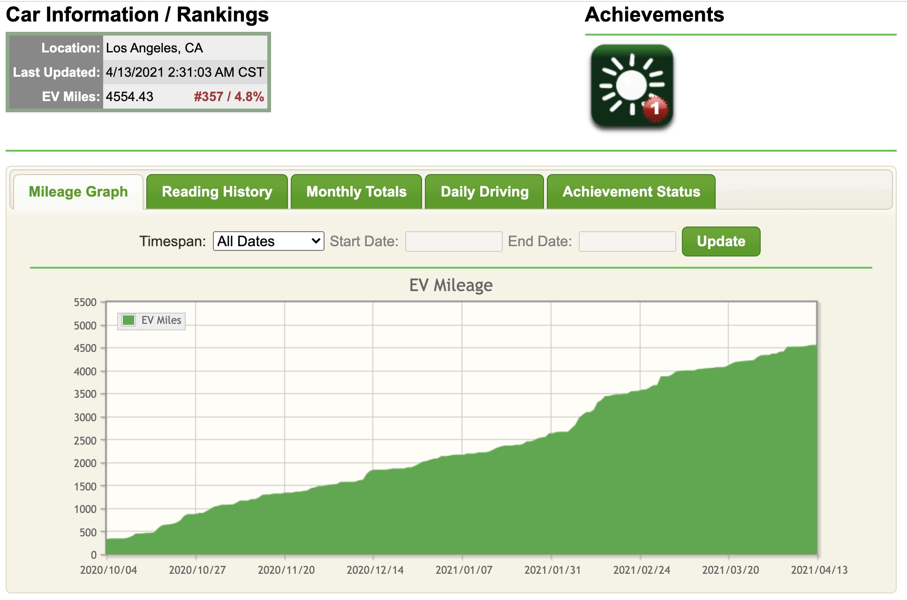
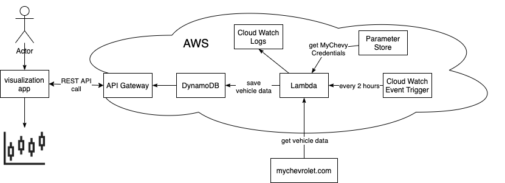
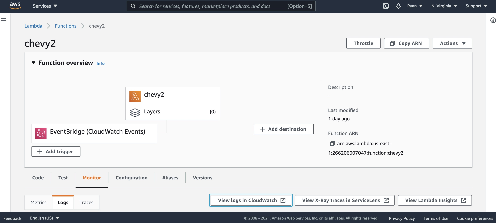
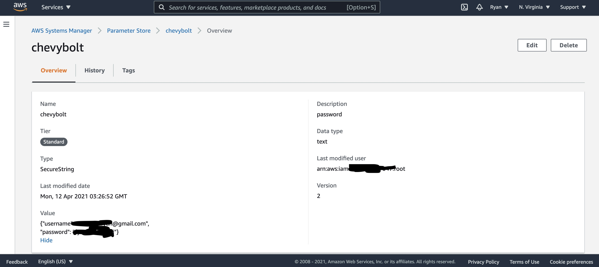
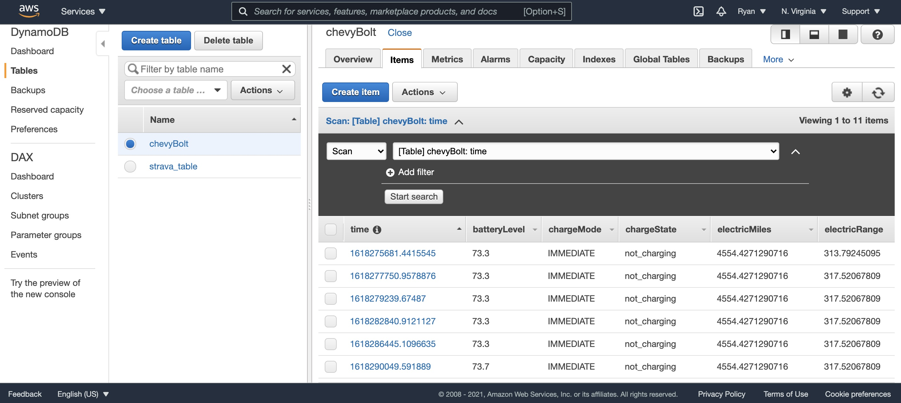

# Bolt Stats

### DEPRECATED: now broken due to a change in the OnStar API. New development at https://github.com/ryanshiroma/boltstats2

voltstats.net is a website that tracks vehicle data from myChevy using the chevrolet API. Example data points include odometer readings, battery level, and charge status.

Sadly, voltstats is set to go offline on April 24th, 2021 which means that I will need to collect this data on my own.
## Bolt Stats
My plan is to build a codebase to replicate and enhance the data visualization functionality of voltstats(sorry, no website)

Steps:

- [x] Set up a process to collect and save data on a regular cadence
- [x] Set up a REST API to pull collected data
- [ ] Create a python data visualization tool for fun views
- [ ] Create a custom component for Home Assistant with visualizations 
- [ ] Create a CloudFormation template for all above AWS resources.
- [ ] Add API Gateway user authentication

This diagram already took me too long to make.

## Step 1 Data Collection Process

code is in the `lambda` folder. documentation is WIP

